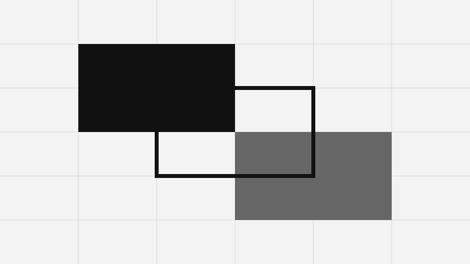

+++
title = "部件演示"
description = "主题常用内容元素的参考页面。"
+++

本页面用于检查原生 Markdown、语义化 HTML 与可复用 Zola Component 的显示效果。

## 文字排版

普通正文可以包含**粗体**、*斜体*、~~删除线~~、***粗斜体***、**~~粗体删除线~~**、*~~斜体删除线~~*以及***~~全部样式的组合~~***。还可以包含`行内代码`、H<sub>2</sub>O、x<sup>2</sup>、<abbr title="超文本标记语言">HTML</abbr>、<del>已删除文字</del>、<ins>插入文字</ins>、<small>小号文字</small>、行内<q>引用</q>与 Emoji :sparkles:。

这里还有、、行内标注与键盘输入。

## 链接与按钮

这是一个[站内链接](@/about.md)、一个[外部链接](https://www.getzola.org/)、一个邮件链接 <hello@example.com>，以及指向[音频示例](demo-tone.wav)的直接下载链接。




## 标题

### 三级标题

#### 四级标题

##### 五级标题

###### 六级标题

## 列表

- 第一项无序列表
- 第二项无序列表
  - 嵌套项目
  - 另一项嵌套项目
- 最后一项无序列表

1. 第一项有序列表
2. 第二项有序列表
   1. 嵌套有序项目
   2. 另一项嵌套项目
3. 最后一项有序列表

- [x] 已完成任务
- [ ] 未完成任务

术语一
: 第一个术语的定义。

术语二
: 定义中也可以包含**格式化文字**。

## 引用

> 良好的结构会让小型界面更容易扩展。
>
> —— 主题演示

## 提示框

> [!NOTE]
> 注意用于提供读者需要了解的背景信息。

> [!TIP]
> 提示用于给出实用的改进建议。

> [!IMPORTANT]
> 重要信息会影响功能的正确使用。

> [!WARNING]
> 警告用于提醒可能出现的问题。

> [!CAUTION]
> 危险提示用于说明可能造成损害的后果。


这条提示由可复用的 Zola Component 渲染。


## 代码

行内代码的显示效果类似 `cargo build`。

```toml
title = "Monochrome"
compile_sass = true
```


fn main() {
    println!("你好，Zola");
}



zola build
zola check


## 表格

| 元素       | 用途           | 原生支持     |
| ---------- | -------------- | ------------ |
| Markdown   | 结构化写作     | 是           |
| Component  | 可复用界面     | 是           |
| JavaScript | 可选的代码复制 | 默认关闭     |

## 折叠区域


这个区域使用原生 `details` 与 `summary` 元素，不依赖 JavaScript。


## 媒体









## 嵌入内容与表单控件

<fieldset>
  <legend>控件示例</legend>
  <label for="demo-text-zh">文字输入框</label>
  <input id="demo-text-zh" name="demo-text" type="text" placeholder="可编辑示例">
  <label><input type="checkbox" checked> 复选框</label>
  <label><input type="radio" name="demo-choice-zh" checked> 第一项选择</label>
  <label><input type="radio" name="demo-choice-zh"> 第二项选择</label>
  <label for="demo-select-zh">下拉选择</label>
  <select id="demo-select-zh" name="demo-select"><option>第一项</option><option>第二项</option></select>
  <label for="demo-message-zh">多行文本框</label>
  <textarea id="demo-message-zh" name="demo-message" rows="3">一条简短消息。</textarea>
  <button type="button">原生按钮</button>
</fieldset>

{{<content.progress label="阅读进度" value={72} />}}

<p class="meter-example"><label for="storage-meter-zh">存储空间</label> <meter id="storage-meter-zh" min="0" max="100" value="64">64%</meter></p>

当前时间可以表示为 <time datetime="2026-08-12">2026 年 8 月 12 日</time>；变量值可以使用 <var>n</var>；示例输出可以使用 <samp>构建完成</samp>；引用来源可以使用 <cite>Zola 文档</cite>。

---

## 脚注

这句话包含一个脚注。[^first] 第二个引用可以指向更长的注释。[^second]

[^first]: 脚注会统一显示在文章末尾，并提供返回链接。

[^second]: 脚注中可以包含**粗体文字**、链接与`行内代码`等格式。
